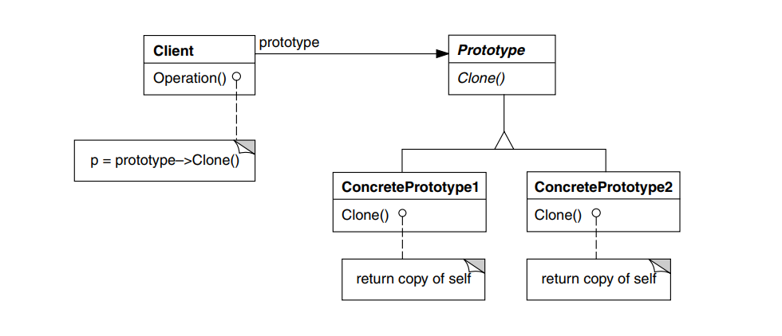

---
export_on_save:
  html: true
---

# Framework para Jogos de Tabuleiro

Grupo composto por Filipe, Isaque, Matheus

## Builder

### Intenção

Separar a construção de um objeto complexo da sua representação de modo que o
mesmo processo de construção possa criar diferentes representações.

### Motivação

O padrão Builder foi empregado para facilitar a criação de instâncias complexas da classe Board, abstraindo os detalhes de configuração e montagem de seus componentes internos. Essa abordagem promove a clareza e a fluidez na construção de tabuleiros com diferentes tamanhos, peças ou regras específicas, permitindo que o processo de instanciação seja desacoplado da representação final. Assim, o framework oferece flexibilidade para que diferentes tipos de jogos definam seus próprios "tabuleiros" de maneira coesa e legível, sem comprometer a integridade da classe principal.

### Código

<!-- @include: ./src/framework/board/DrawingBoardBuilder.java -->

### Estrutura

### Participantes

- Builder
  - especifica uma interface abstrata para criação de partes de um objetoproduto.
- ConcreteBuilder
  - constrói e monta partes do produto pela implementação da interface de
Builder;
  - define e mantém a representação que cria;
  - fornece uma interface para recuperação do produto

- Product
  - representa o objeto complexo em construção. ConcreteBuilder constrói a
representação interna do produto e define o processo pelo qual ele é
montado;
  - inclui classes que definem as partes constituintes, inclusive as interfaces
para a montagem das partes no resultado final.

## Prototype

### Intenção

Especificar os tipos de objetos a serem criados usando uma instância-protótipo e criar novos objetos pela cópia desse protótipo.

### Motivação

O padrão Prototype foi adotado para a criação de peças e quadrados no tabuleiro com o objetivo de evitar a necessidade de se criar uma nova classe para cada variação possível desses elementos. Ao permitir a clonagem de instâncias previamente configuradas, o framework torna mais ágil e flexível o processo de definição de novos tipos de peças e quadrados, promovendo a reutilização de configurações e comportamentos. Isso reduz a complexidade da hierarquia de classes e facilita a customização dos componentes dos jogos de forma dinâmica e eficiente.

### Código

<!-- @include: ./src/framework/piece/PiecePrototype.java -->

### Estrutura

### Participantes

- Prototype
  - declara uma interface para clonar a si próprio.
- ConcretePrototype
  - implementa uma operação para clonar a si próprio.
- Client
  - cria um novo objeto solicitando a um protótipo que clone a si próprio.

## Factory Method

### Intenção

Definir uma interface para criar um objeto, mas deixar as subclasses decidirem que classe instanciar. O Factory Method permite adiar a instanciação para subclasses.

### Motivação

O padrão Factory Method foi empregado na classe Game para delegar às subclasses a responsabilidade de definir como o tabuleiro, bem como os catálogos de peças e quadrados, devem ser criados. Essa decisão favorece a extensibilidade do framework, permitindo que cada jogo defina suas próprias regras e estruturas sem alterar o núcleo da lógica do sistema. Com isso, ao estender a classe Game, o desenvolvedor pode configurar a construção dos elementos principais do jogo de forma personalizada, mantendo o código flexível, organizado e aderente ao princípio do aberto/fechado.

### Código

<!-- @include: ./src/framework/game/Game.java -->

### Estrutura

### Participantes

- Product
  - define a interface de objetos que o método fábrica cria.
- ConcreteProduct
  - implementa a interface de Product.
- Creator
  - Declara o método fábrica, o qual retorna um objeto do tipo Product. Creator pode também definir uma implementação por omissão do método factory que retorna por omissão um objeto ConcreteProduct.

## Command

### Intenção

Encapsular uma solicitação como um objeto, desta forma permitindo parametrizar clientes com diferentes solicitações, enfileirar ou fazer o registro (log) de solicitações e suportar operações que podem ser desfeitas.

### Motivação

Diante da grande variedade de ações que um jogador pode realizar durante uma partida — que vão além de simples jogadas e podem incluir, por exemplo, habilidades específicas de peças — o padrão Command foi utilizado para encapsular cada ação como um objeto independente. Dessa forma, cada peça é capaz de gerar e fornecer uma lista de comandos representando suas possibilidades de ação em determinado momento do jogo. Isso promove uma estrutura mais organizada, permitindo que ações sejam tratadas de forma uniforme, facilitando o controle de execução, desfazer/refazer ações, além de permitir fácil extensão para novos tipos de jogadas sem modificar o código existente.

### Código

<!-- @include: ./src/framework/commands/Command.java -->

### Estrutura

### Participantes

- Command
  - declara uma interface para a execução de uma operação.
- ConcreteCommand
  - define uma vinculação entre um objeto Receiver e uma ação;
  - implementa Execute através da invocação da(s) correspondente(s)
operação(ões) no Receiver.
- Client
  - cria um objeto ConcreteCommand e estabelece o seu receptor.
- Invoker
  - solicita ao Command a execução da solicitação.
- Receiver
  - sabe como executar as operações associadas a uma solicitação. Qualquer classe pode funcionar como um Receiver.

## Observer

### Intenção

Definir uma dependência um-para-muitos entre objetos, de maneira que quando um objeto muda de estado todos os seus dependentes são notificados e atualizados automaticamente.

### Motivação

Para lidar com situações em que peças ou quadrados precisam reagir a eventos no tabuleiro — como mudanças de estado ou ações de outros jogadores —, foi adotado o padrão Observer. Esse padrão permite que apenas os elementos interessados se inscrevam para receber notificações, evitando a necessidade de notificar todas as instâncias indiscriminadamente. Com isso, o framework garante uma comunicação mais eficiente e desacoplada entre os componentes, promovendo escalabilidade e melhor desempenho, especialmente em jogos com um grande número de elementos dinâmicos no tabuleiro.

### Código

<!-- @include: ./src/framework/observer/GameStateUpdateObserver.java -->

<!-- @include: ./src/framework/observer/GameStateUpdateSubject.java -->

### Estrutura

### Participantes

- Subject
  - conhece os seus observadores. Um número qualquer de objetos Observer pode observar um subject.
  - fornece uma interface para acrescentar e remover objetos, permitindo associar e desassociar objetos observer.
- Observer
  - define uma interface de atualização para objetos que deveriam ser notificados sobre mudanças em um Subject.
- ConcreteSubject
  - armazena estados de interesse para objetos ConcreteObserver.
  - envia uma notificação para os seus observadores quando seu estado muda.
- ConcreteObserver
  - mantém uma referência para um objeto ConcreteSubject.
  - armazena estados que deveriam permanecer consistentes com os do Subject.
  - implementa a interface de atualização de Observer, para manter seu estado consistente com o do subject.

### Referências

 GAMMA, Erich. et al. Padrões de projetos: Soluções reutilizáveis de software orientados a objetos Bookman editora, 2009.
