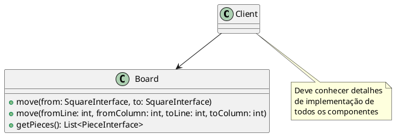
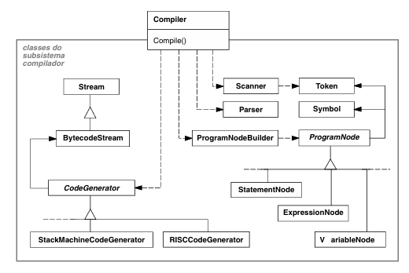
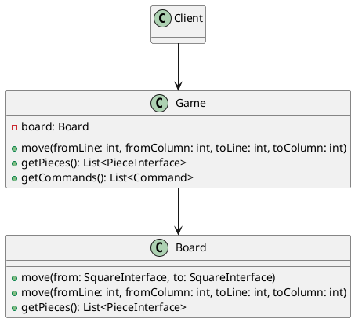
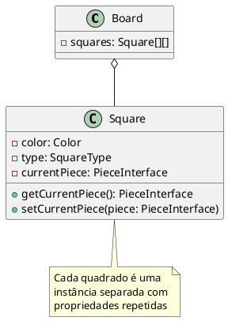
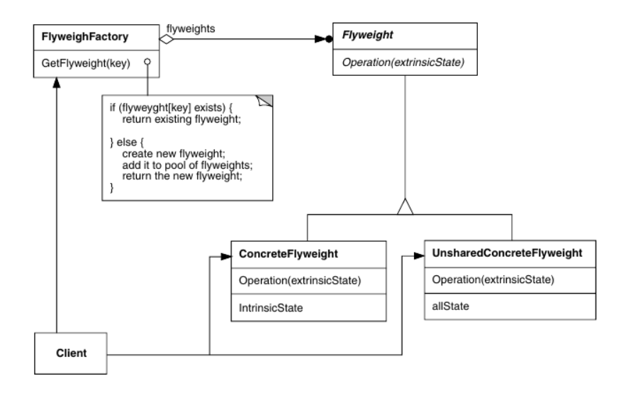
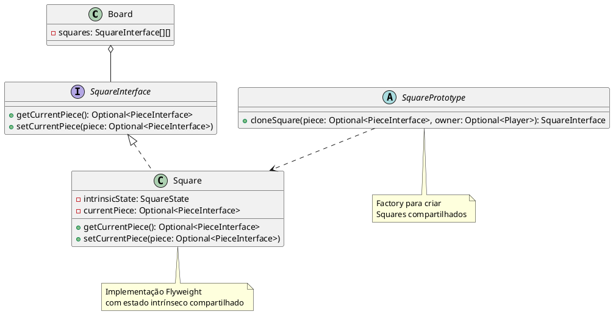
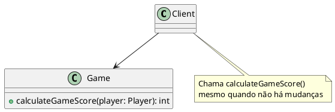
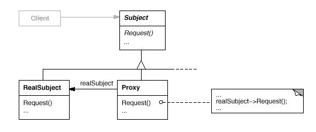
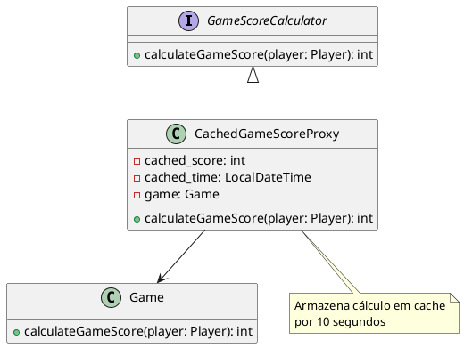

## Padrão Facade

### Intenção
Fornecer uma interface unificada para um conjunto de interfaces em um subsistema. Facade define uma interface de nível mais alto que torna o subsistema mais fácil de ser usado.

### Motivação

#### Cenário sem a aplicação do padrão
Sem o padrão Facade, os clientes precisariam interagir diretamente com os diversos componentes do sistema de jogos, conhecendo detalhes de implementação do tabuleiro, peças, e outros subsistemas.

**Problema**: Os clientes teriam que conhecer as interfaces e interações de todos os componentes, aumentando o acoplamento e dificultando o uso do sistema.

**Classes envolvidas sem o padrão:**
- Clientes (classes que usam o sistema de jogos)
- `Board` - Tabuleiro com métodos específicos



#### Estrutura do padrão (GoF - papeis)




**Papéis:**
- **Facade**: Fornece uma interface unificada de alto nível
- **Subsistemas**: Classes que implementam funcionalidades específicas
- **Cliente**: Utiliza o Facade para acessar os subsistemas

#### Padrão aplicado no cenário

No framework de jogos, a classe `Game` atua como Facade, proporcionando métodos simplificados para acessar funcionalidades do tabuleiro (`Board`).



#### Participantes

**Facade**:
- `Game` - Fornece interface simplificada para os subsistemas

**Subsistemas**:
- `Board` - Gerencia o tabuleiro e as operações relacionadas

#### Código

**Código do Framework (Facade):**

```java
// Game.java (trecho relevante do Facade)
public abstract class Game implements GameStateUpdateSubject, GameScoreCalculator {
    // ...
    private Board board;
    // ...
    
    // Métodos de fachada que delegam para o Board
    public void move(int fromLine, int fromColumn, int toLine, int toColumn) {
        this.board.move(fromLine, fromColumn, toLine, toColumn);
    }
    
    public List<PieceInterface> getPieces(){
        return this.board.getPieces();
    }
    
    // Fachada que abstrai a obtenção de comandos das peças
    public List<Command> getCommands() {
        return this.board.getPieces().stream().map(
                PieceInterface::getAvaliableCommands
        ).flatMap(
                List::stream
        ).toList();
    }
    // ...
}
```

**Código de uso (exemplo hipotético):**

```java
// Código de cliente utilizando a fachada
public class GameClient {
    public void executeGameMove(Game game) {
        // Usa a fachada para movimentar peças sem conhecer detalhes do Board
        game.move(0, 0, 1, 1);
        
        // Obtém peças através da fachada
        List<PieceInterface> pieces = game.getPieces();
        
        // Obtém comandos disponíveis através da fachada
        List<Command> commands = game.getCommands();
    }
}
```

## Padrão Flyweight

### Intenção
Otimizar o uso de memória através do compartilhamento eficiente de objetos similares, permitindo que grande quantidade de elementos de granularidade fina (como os quadrados do tabuleiro) possam ser representados sem desperdício de recursos.

### Motivação

#### Cenário sem a aplicação do padrão
Em um jogo de tabuleiro, cada quadrado (square) poderia ser representado como um objeto individual com seu próprio estado, mesmo quando muitos quadrados compartilham características idênticas.

**Problema**: Em um tabuleiro com muitos quadrados (como xadrez, com 64 posições), criar objetos individuais com estados redundantes consumiria memória desnecessariamente.

**Classes envolvidas sem o padrão:**
- `Square` - classe representando cada posição do tabuleiro
- `Board` - contendo potencialmente muitas instâncias de Square



#### Estrutura do padrão (GoF - papeis)



**Papéis:**
- **Flyweight**: Interface para objetos que podem compartilhar estado
- **ConcreteFlyweight**: Implementa a interface Flyweight e armazena o estado intrínseco
- **FlyweightFactory**: Cria e gerencia objetos Flyweight
- **Client**: Usa os flyweights, mantendo o estado extrínseco quando necessário

#### Padrão aplicado no cenário

No framework, o padrão Flyweight é aplicado para compartilhar quadrados do tabuleiro com propriedades comuns, através das classes `SquarePrototype` e implementações como `Square`.



#### Participantes

**Flyweight**:
- `SquareInterface` - Interface para os quadrados do tabuleiro

**ConcreteFlyweight**:
- `Square` - Implementação que armazena o estado intrínseco compartilhado

**FlyweightFactory**:
- `SquarePrototype` - Cria e gerencia os objetos quadrados

**Cliente**:
- `DrawingBoardBuilder` - Usa os flyweights para construir o tabuleiro

#### Código

**Código do Framework (Flyweight):**

```java
// Parte da implementação de Flyweight (referenciada no código)
package framework.square.flyweightImpl;

import framework.piece.PieceInterface;
import framework.square.SquareInterface;

import java.util.Optional;

public class Square implements SquareInterface {
    // Estado intrínseco (compartilhado)
    private final SquareState state;
    
    // Estado extrínseco (varia por instância)
    private Optional<PieceInterface> currentPiece;
    
    public Square(SquareState state, Optional<PieceInterface> currentPiece) {
        this.state = state;
        this.currentPiece = currentPiece;
    }
    
    @Override
    public Optional<PieceInterface> getCurrentPiece() {
        return currentPiece;
    }
    
    @Override
    public void setCurrentPiece(Optional<PieceInterface> piece) {
        this.currentPiece = piece;
    }
}
```

**Código de uso (exemplo hipotético):**

```java
// Exemplo de fábrica de protótipos para quadrados de xadrez
public class ChessSquarePrototype extends SquarePrototype {
    private final SquareState whiteState;
    private final SquareState blackState;
    
    public ChessSquarePrototype() {
        // Cria estados intrínsecos compartilhados
        this.whiteState = new SquareState(Color.WHITE);
        this.blackState = new SquareState(Color.BLACK);
    }
    
    @Override
    public SquareInterface cloneSquare(Optional<PieceInterface> piece, Optional<Player> owner) {
        // Determina qual estado usar (para quadrados pretos ou brancos)
        SquareState stateToUse = owner.isPresent() && owner.get().getId() == 1 ? 
                                blackState : whiteState;
        
        // Cria quadrado com o estado intrínseco compartilhado
        return new Square(stateToUse, piece);
    }
}
```

## Padrão Proxy

### Intenção
Fornecer um substituto ou marcador da localização de outro objeto para controlar o acesso a esse objeto. Geralmente é usado quando o objeto é muito custoso de ser carregado.

### Motivação

#### Cenário sem a aplicação do padrão
Em um jogo, o cálculo da pontuação pode ser uma operação custosa que é frequentemente solicitada pelos jogadores ou pela interface.

**Problema**: Calcular o score do jogo repetidamente, mesmo quando não houve mudanças no estado do jogo, seria ineficiente.

**Classes envolvidas sem o padrão:**
- `Game` - Contém o método para calcular a pontuação
- Clientes que solicitam a pontuação repetidamente



#### Estrutura do padrão (GOF - papeis)



**Papéis:**
- **Subject**: Interface comum para RealSubject e Proxy
- **RealSubject**: Objeto real que o proxy representa
- **Proxy**: Mantém referência ao RealSubject e controla seu acesso

#### Padrão aplicado no cenário

No framework, o padrão Proxy é aplicado através da classe `CachedGameScoreProxy` que armazena em cache o resultado do cálculo de pontuação por um período, evitando recálculos desnecessários.



#### Participantes

**Subject**:
- `GameScoreCalculator` - Interface para calcular a pontuação

**RealSubject**:
- `Game` - Implementa o cálculo real da pontuação

**Proxy**:
- `CachedGameScoreProxy` - Armazena em cache o resultado e controla quando recalcular

#### Código

**Código do Framework (Proxy):**

```java
// GameScoreCalculator.java
public interface GameScoreCalculator {
    int calculateGameScore(Player player);
}

// Game.java (trecho relevante)
public abstract class Game implements GameStateUpdateSubject, GameScoreCalculator {
    // ...
    public int calculateGameScore(Player player) {
        int score = 0;

        for (PieceInterface piece : this.board.getPieces()) {
            if (piece.getOwner() == player) {
                score += 1;
            }
        }
        return score;
    }
    // ...
}

// CachedGameScoreProxy.java
public class CachedGameScoreProxy implements GameScoreCalculator {

    private int cached_score;
    private LocalDateTime cached_time;
    private Game game;

    public CachedGameScoreProxy(Game game) {
        this.game = game;
        this.cached_time = LocalDateTime.now();
    }

    @Override
    public int calculateGameScore(Player player) {
        if (cached_time.isBefore(LocalDateTime.now().minusSeconds(10))) {
            cached_score = game.calculateGameScore(player);
            cached_time = LocalDateTime.now();
        }
        return cached_score;
    }
}
```

**Código de uso (exemplo hipotético):**

```java
// Exemplo de cliente utilizando o proxy
public class ScoreboardDisplay {
    private GameScoreCalculator scoreCalculator;
    
    public ScoreboardDisplay(Game game) {
        // Usa o proxy para evitar cálculos frequentes
        this.scoreCalculator = new CachedGameScoreProxy(game);
    }
    
    public void refreshDisplay(Player player) {
        // Obtém pontuação (potencialmente do cache)
        int score = scoreCalculator.calculateGameScore(player);
        
        // Atualiza a interface
        System.out.println("Player " + player.getName() + " score: " + score);
    }
}
```